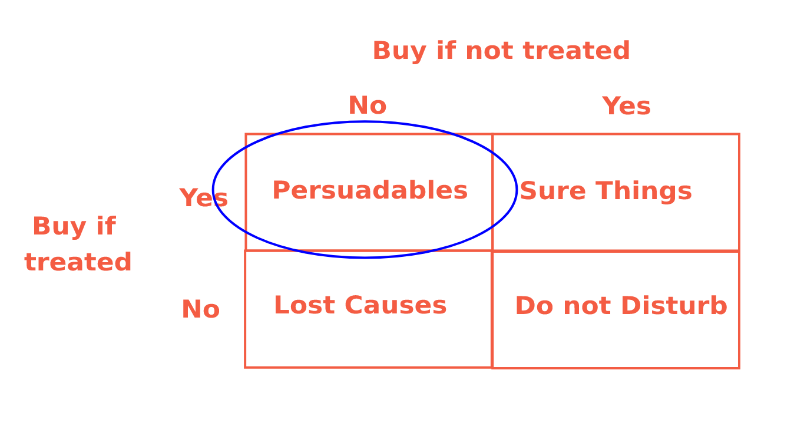
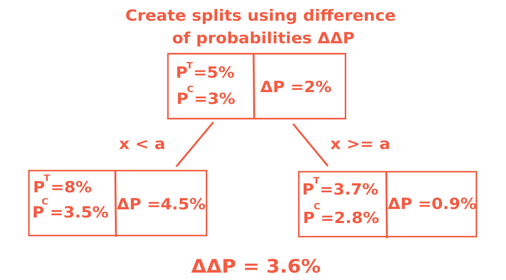

# UPLIFT  TREE

To retain customers, they often build churn models that predict which customers will abandon the company's services and try to retain them through marketing influence.
Examples of marketing influence: email, sms, push notifications, discount, favorable offer, etc. But the direct business value of churn models is not there.
Because we don't have any information about which of the affected customers will change their mind about leaving, and which ones will leave anyway



## Uplift Modeling

Uplift modeling evaluates the incremental effect of communication by trying to select clients who will perform the target action (subscribe, purchase services) only in response to our interaction (for example, sending a push-notification). The model assesses the difference in customer behavior in the presence and absence of influence.

By predicting uplift and choosing the type of presentation, we focus on only one type of clients – the persuadable ones.

Customer segments according to uplift modeling:

1. **Sure Things** – They would have made the purchase anyway. Targeting them means wasting money on unnecessary marketing.
2. **Persuadables** – They only buy if influenced by some marketing action; they are our target group.
3. **Lost Causes** – They will not buy regardless of what we do. Targeting them also means wasting money.
4. **Do Not Disturb** – They were subscribed but then unsubscribed. Due to our notification, they remembered why they had unsubscribed in the first place.

The Uplift model evaluates the net effect of communication, trying to select those customers who will perform a target action (renew subscription, buy services) only when we interact with them (e.g., send a push notification). The model evaluates the difference in customer behavior when there is an impact and when there is no impact.

By predicting uplift and selecting the top predictions, we get only one type of customer - persuasive.

# Uplift tree
There are different methods in uplift modeling. We will consider a method based on a decision tree. This is a fairly simple and well-established method.
The tree is constructed to maximize the distance between the distributions of the target variable in the control and treatment groups.



## How to Calculate DeltaDelta?

We define the uplift score at the top of the tree. It will be equal to the difference between the average values of Y in the target group and in the control group:

$$hat{\tau}_{node} = \frac{\sum_{i \in node} Y_i T_i}{\sum_{i \in node} T_i} - \frac{\sum_{i \in node} Y_i (1 - T_i)}{\sum_{i \in node} (1 - T_i)}$$

Then we need to choose a split of the node where the difference is maximized:

$$Delta = \hat{\tau}_{left} - |\hat{\tau}_{right}|$$

```
Build(vertex):
    If the vertex is at maximum depth, we stop.

    Go through all the features:
        Go through the "possible" (see further in the problem for definition) variants of the threshold:
            Partition the data by (feature, threshold) -> data_left, data_right
            If the partitioning does not satisfy the conditions on the minimum number of objects:
                Continue # i.e. Do not consider this partitioning
            Calculate criterion delta_delta_p

    Select the best partition according to the criterion value.
    By the best partitioning we create the left vertex and the right vertex.
    Build(left vertex)
    Build(right vertex)
```


1. Experiment
2. UpliftModel.fit()
3. UpliftModel.predict()
